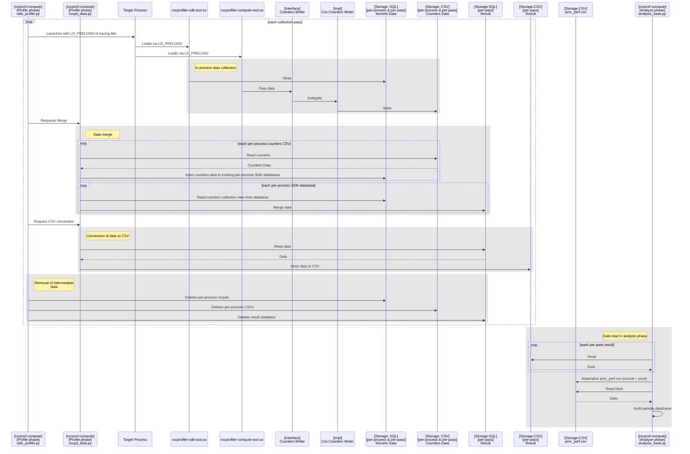
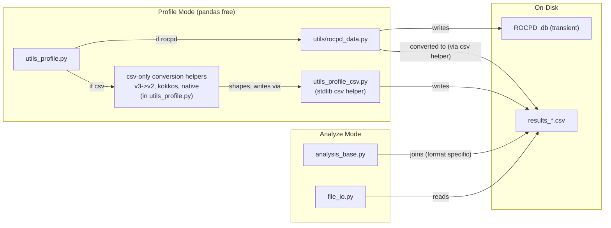
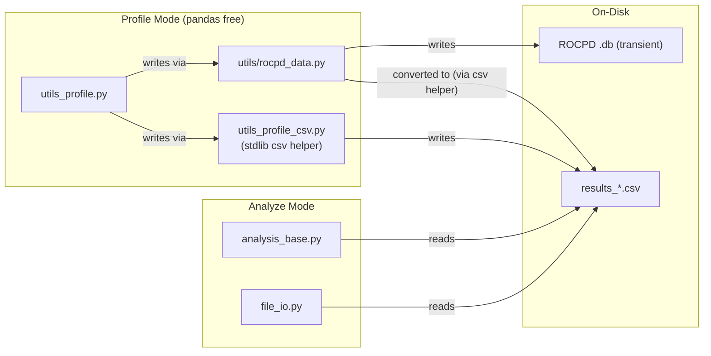
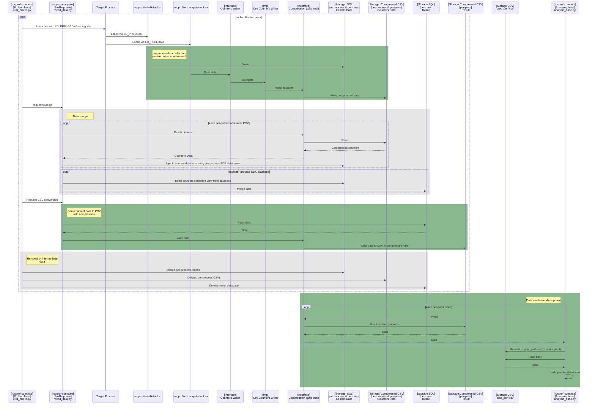
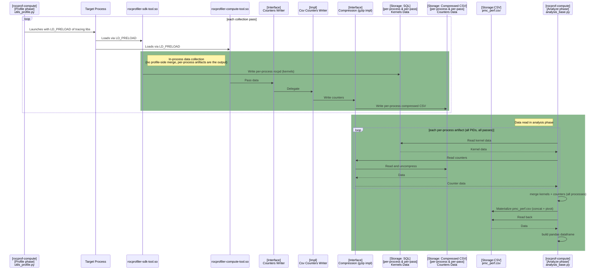
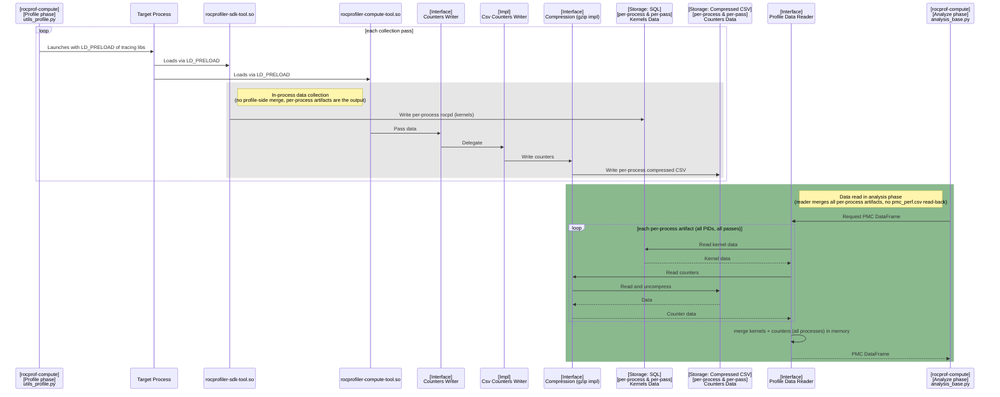
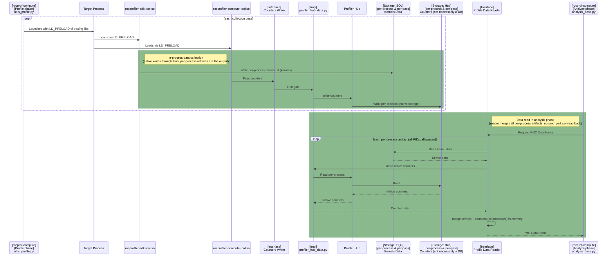

# Profile Interface Architecture

Status: proposal

This document describes the architecture for profile data storage and access in
rocprofiler-compute, and records the decisions made in the design review so the
reasoning behind them is not lost. The goal is to keep storage-format knowledge
in one place behind a clear boundary, so ROCPD, profiler-hub, parquet, or any
future source can be added as a single implementation instead of forcing
profiling, analysis, CLI, TUI, WebUI, and utility code to change with it.

> File names and code locations
> change quickly and should not be treated as final, also "Before" diagrams describe the state of
> the develop branch at the time of writing and will become historical once the
> phases are merged to develop.

## Problem

Profile data storage is becoming more varied:

- ROCPD `.db` is becoming the default and canonical profile output.
- The native tool's counter data sits behind a storage boundary and is not assumed
  to be any specific on-disk format (long-term it is written and read through the
  Profiler Hub, which is not necessarily a database).
- Parquet is a possible future option for large workloads.
- Compress csv-profile outputs with gzip streaming

Today the writing, reading, joining, and pivoting of profile data are thinly
spread across many modules. On-disk file names are hardcoded in multiple places,
and the same modules mix csv joins, rocpd extraction, and analysis expectations.
Every new storage format therefore touches many unrelated modules, which raises
the cost and risk of each change.

There is also a concrete performance motivation where on large (AI) workloads,
profile and analyze time were dominated by redundant reads, writes, and pivots
of intermediate CSVs over millions of rows. We can remove those intermediates by
going straight to an in-memory frame.

## Goal

Reduce format coupling in this order:

1. Remove the old CSV profile backend.
2. Add gzip csv compression.
    - Gzip the result CSV (output of rocpd to CSV conversion)
    - Gzip the native tool counter output
3. Stop the rocpd to csv conversion, stop converting the merged result DB into a unified result CSV. SDK kernels stay in the DB, native counters stay in compressed CSV.
4. Do all merging in analyze: profile does not consolidate per-process artifacts, so each process keeps its own artifact and analyze merges across processes and tools into the DataFrame.
5. Introduce the profile data reader interface, where analyze calls it for the DataFrame.
6. Remove `pmc_perf.csv` as an analyze input; analyze builds the pandas DataFrame from the source artifacts directly.
7. Move the native counter lane behind the Profiler Hub interface.

## User visible architectural Decisions (AD)

The purpose of this section is to outline architectural decisions which potentially impact user experience in order to simplify receiving feedback on them.
For this purpose this also outlines ADs motivation and possible mitigation strategies.

### AD-1: The CSV profile output format support is removed, rocpd becomes the default profile source.

This covers both halves of the CSV backend: the profile-side path that chose and wrote csv, and the analyze-side path that read CSVs.

Primary motivation is that keeping both csv and rocpd forces two parallel storage implementations with different dependencies.
This doubles enabling effort for new analysis types or forces addition of "not supported in CSV" warnings to be sprinkled across every new feature.
Additionally, profile data is an intermediate artifact, which is consumed by analysis phase of rocprof-compute.
Therefore, impact to the end-user is expected to be low.

Users who want to collect profiling data to csv will need to install older version.
Also ROCm SDK rocpd tool allows conversion to CSV as one of the supported formats.
If there is future strong request to return CSV support, we may implement it under a newly defined interface.

*Note: The results_*.csv intermediate that the rocpd path still emits is removed in Phase C (AD-3), when the rocpd-to-csv conversion stops and SDK kernels are read from the DB directly.*

### AD-2: Compress remaining CSV intermediates

Gzip is short-term storage-size reduction for CSV artifacts that still exist
after CSV profile backend removal.

We introduce gzip streaming for two separate csv artifacts, written through its own compression interface used by both python and backend:
 - the results_*.csv(s), written by compute's Python side (rocpd_data.py) at the end of a pass, when the merged result DB is converted to csv and is the artifact analyze reads today.
 - the native tool counter output (countersData), written by the native tool / backend (rocprofiler-compute-tool.so via the counters writer) during in-process collection. This is an early per-process intermediate.

Compression belongs at CSV read/write, where profile writes compressed CSV
and analyze reads compressed CSV. Other profile and analyze code should not take
on gzip-specific behavior.

### AD-3: Keep SDK and native counter data in separate lanes

Today the profile data merge fuses the two data types: native counter data is
injected into the SDK kernel ROCPD, so everything downstream sees one combined
artifact.

AD-3 removes that fusion. SDK kernel data (from the SDK tool) and native counter
data (from the native tool) stay in separate storage lanes through profile and
analyze, and are combined only in memory when analyze builds the DataFrame.

Keeping the lanes separate lets each evolve its storage independently, where the native
counter path can move to Profiler Hub, parquet, or another format without reshaping
the SDK ROCPD path. Gzip (Phase B) is a separate, earlier change and does not depend
on this separation.

### AD-4: Analyze reads through the profile data interface

Analyze should not know which profile artifacts exist on disk, it runs through the
profile data interface for the pandas DataFrame.

The reader interface reads SDK/kernel data from ROCPD, reads native/counter
data from its storage path, and does all merging in memory: across processes
(per-PID artifacts) and across tools (SDK + native).

> Note: Profile mode does not consolidate or process data, so there is no profile-side
writer. Collectors write their raw per-process artifacts directly and the reader is
the only boundary that combines them.

### AD-5: Analyze scripts don't generate intermediate `pmc_perf.csv` by default anymore

Eliminate `pmc_perf.csv` generation step, so analysis converts profile output directly to pandas dataframe in memory.

Currently, EVERY analyze run materializes `pmc_perf.csv` and then reads it back.
Therefore all profile formats go through a CSV regardless of how they were stored.
This has performance cost and defeats the point of supporting varied storage and adds large csv pivot cost on big workloads.
Also this introduces unnecessary dependency as any output format reader is forced to also produce a CSV just so downstream analyze code can read it.

Essentially, `pmc_perf.csv` is an intermediate not a public contract, so analyze should not depend on it.

The merged frame depends on the user's **analysis filters**, so a one time materialize and reuse does not work.
The reader builds the frame from source **per analysis run** with filters applied in memory and the `pmc_perf.csv` export is derived from that frame.

However, `pmc_perf.csv` generation could be useful for debugging purposes and some users may use it in their flow.
Therefore, we will add a new debug option `--gen-pmc` which implements one-way export of this file.
However, analysis scripts will not read its back.

### AD-6: Native counter storage moves behind the Profiler Hub

Move the native counter lane behind the
Profiler Hub interface (a `profiler_hub_data.py` implementation selected at the
boundary), written and read through the Hub rather than straight as compressed CSV.

The SDK still writes raw rocpd directly, profile does not consolidate per-process
artifacts, and the reader merges everything in analyze.

## Boundaries

### Unit tests do not touch disk

Disk I/O lives behind thin adapters. Unit tests mock the reader and assert what is passed across the boundary.

### No pandas in profiling

Profile mode stays pandas-free. Pandas is allowed in analyze mode, where source
artifacts are read and normalized into a DataFrame.

## Phase Order

Phase order: A (remove CSV profile backend) -> B (gzip CSV read/write) -> C
(native tool counter storage + stop the rocpd-to-csv conversion) -> D (profile
data interface + remove `pmc_perf.csv` as an analyze input) -> Phase E (Profiler Hub).

Backend execution cleanup and future storage formats are follow-ups unless they
are required by one of these phases.

## Current Collection Architecture

Collection mode: ROCPD. Equals post-Phase-A (removal of CSV backend).

## Phase A: Remove the CSV Profile Backend

Phase A deletes the csv format choice and the csv-format analyze branch, but
keeps the rocpd read path (`results_*.csv` -> `pmc_perf.csv`). Phase A changes nothing visible in the above sequence diagram.

### Before

### Target

Removed in this phase:

- the `if csv` branch in `utils_profile.py` and related csv-only conversion helpers
- the `--format-rocprof-output` flag and its uses (default and only output becomes rocpd)
  - while this phase results in a single format output being rocpd, we still keep the variable _PROFILE_OUTPUT_FORMAT to align with the Phase B boundary to leave the door open for future formats.
- related csv-only test functions
- analyze no longer supports csv-shaped workload directories.

Intentionally **kept** in this phase:

- Rocpd path still converts each `.db` into `results_*.csv`,
  and analyze still reads `results_*.csv` through the rocpd concat path. Removing
  it requires analyze to read the frame directly from `.db`, which happens in
  Phase C (AD-3) when the rocpd-to-csv conversion stops.
- `utils_profile_csv.py`. It is still a necessary csv helper file used by the
  rocpd path, `sysinfo.csv`, and marker-trace augmentation. It is removed as csv intermediates are eliminated in later phases.

Note: Two workloads in rocprof-compute /vcopy/MI350 currently store csv intermediates, and were generated before rocpd support was added. These workloads must be regenerated to match the other workloads, all of which have rocpd intermediates.

### Phase A-2: Remove the now-dead `--join-type` option

`--join-type {kernel,grid}` only ever fed the csv-format wide merge in
`join_prof`. With that merge removed in Phase A, nothing
in `src/` reads it, and `grid` vs `kernel` now produce identical output
Removing it is a small follow-up to Phase A rather than part of the csv-output
removal itself because it also deletes user-facing surface, the dedicated
`join_type_grid` / `join_type_kernel` golden workloads, their related tests,
and the `--join-type` references in the docs.

## Phase B: Add Compression at CSV Read/Write

We are to introduce gzip streaming to provide a size reduction to csv files.
Phase B does not change the shape of
the profile/analyze contract yet, profile still produces the per-pass CSV result
and analyze still reads it.

The change goes through one
compression interface shared by both the native/backend counter writer
and the Python result-CSV writer. Compression is applied at two write points, the
native counter output and the result CSV, and decompressed on read
(during merge in analyze).

## Phase C: Native Tool Counter Storage

This phase untangles the two data types on the profile side (AD-3), and profile
stops consolidating per-process artifacts:

- SDK kernel data stays as its own per-process rocpd (no rocpd-to-csv conversion).
- Native counter data stays as its own per-process compressed CSV.

There is no per-process -> per-pass merge in profile; each process keeps its own
artifact, so profile needs no writer. Analyze reads all per-process artifacts
across both lanes, merges them, and still materializes `pmc_perf.csv`; the reader
interface and dropping `pmc_perf.csv` come in Phase D.

## Phase D: Profile Data Interface and Drop `pmc_perf.csv` as Analyze Input

Results from SDK and native collector are processed independently in profiling
and analysis.

This is the profile interface architecture phase. Analyze asks the profile data
interface (a reader) for the DataFrame. The reader reads all per-process SDK kernel
rocpds and all per-process native counter artifacts, and merges them in memory
(across processes and tools). `pmc_perf.csv` may still be generated as a one-way
export, but analyze does not read it back.

Profile does not consolidate or process data, so there is no profile-side writer.
The profile side is identical to Phase C; only the analyze side changes here.

## Phase E: Profiler Hub

The native counter lane moves behind the Profiler Hub interface (a
`profiler_hub_data.py` implementation selected at the boundary), written and read
through the Hub rather than as compressed CSV. Compute never assumes rocpd/SQLite
for Hub storage. The SDK still writes raw rocpd directly, profile still does not
consolidate per-process artifacts, and the reader merges everything in analyze.
Goals:
- Add a CMake toggle on the native collector that routes its writes through
  the Profiler Hub (to a DB) to validate whether the Hub is good enough. This step
  is write-only and does not change analyze.
- The analyze read path moves to the Hub later, once Hub read support (with Python
  bindings) exists and we commit to that direction.

## Optimizations

> **Note:** Impacts are estimations and not empirically measured.

| Optimization | Phase | Impact |
|---|---|---|
| Remove CSV profile backend | A | Single storage path; removes dual-format maintenance and per-feature "not supported in CSV" cost |
| gzip counter CSV artifacts | B | 3-10x smaller counter CSVs |
| Independent SDK/native lanes | C | Allows swapping the native lane to parquet/Hub without touching the SDK path |
| No per-process merge in profile (each PID an artifact) | C | Analyze merges the per-PID artifacts it iterates anyway; removes per-format mergers and the profile-side writer. Trade-off: more artifacts on disk |
| Stop unified rocpd->CSV conversion (kernels stay in DB) | C | Removes per pass kernel conversion and read back in profile |
| Drop `pmc_perf.csv` materialize + read-back | D | Removes one full CSV write + read + pivot per analyze run over millions of rows; largest analyze optimization on big workloads |
| Profiler Hub / parquet native storage | E | Long term storage solution / hub |

## Follow-Ups

- Backend execution cleanup can remove the legacy `rocprofv3` script layer and
  keep `rocprofiler-sdk` as the single backend.
- PC sampling JSON and analyze-derived outputs need separate design work.

## Success Criteria

- Profile mode cannot produce the legacy CSV profile output format.
- Remaining CSV artifacts are compressed while they still exist.
- SDK kernel data and native counter data can be read independently by analyze.
- Analyze gets the DataFrame through the profile data interface.
- `pmc_perf.csv` is not an analyze input.
- The final ROCPD-to-CSV conversion is removed.
- Analyze builds the pandas DataFrame from source artifacts instead of reading a
  generated `pmc_perf.csv` as the profile-data contract.
- Profile mode remains pandas-free.
- Native counter storage can be served through the Profiler Hub interface without
  compute assuming a database (Phase E).
